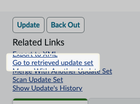
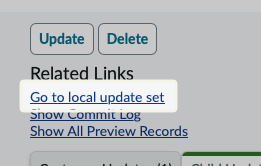

# Go to local / retrieved update set

Small utility that include a related link in local and retrieved update sets to quickly navigate to the related update set. This is especially useful for developers who need to quickly switch between local and retrieved update sets while working on changes.

 

The xml file contains two business rules that add to the scratchpad object the sys_id of the related update set and two UI actions that use the sys_id from the scratchpad to navigate to the related update set.

The first business rule runs on the `sys_remote_update_set` table and adds the sys_id of the local update set to the scratchpad. The second business rule runs on the `sys_update_set` table and adds the sys_id of the retrieved update set to the scratchpad. Both business rule run before display.

The first UI action is added to the form of the local update set and navigates to the retrieved update set, while the second UI action is added to the form of the retrieved update set and navigates to the local update set. Both UI actions are added as related links, allowing users to easily access this functionality without needing to navigate through additional menus or settings. Available for users with the `admin` role.
